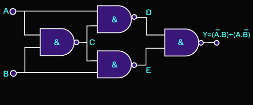

## DIGITAL ELECTRONICS

 

# GATES

## NOT GATE 

## AND GATE 

## OR GATE 

 

# LOGIC

## *Idempotency*
<!--
> A & A = A  
> A | A = A  
-->
$$\begin{align*}
A \land A & = A \\
A \lor  A & = A \\
\end{align*}$$

## *Annulment*
<!--
> A & 0 = 0  
> A | 1 = 1  
-->
$$\begin{align*}
A \land 0 & = 0 \\
A \lor  1 & = 1 \\
\end{align*}$$

## *Identity*
<!--
> A & 1 = A  
> A | 0 = A  
-->
$$\begin{align*}
A \land 1 & = A \\
A \lor  0 & = A \\
\end{align*}$$

## *Complement*
<!--
> A & ~A = 0  
> A | ~A = 1  
-->
$$\begin{align*}
A \land \neg A & = 0 \\
A \lor  \neg A & = 1 \\
\end{align*}$$

## *Commutativity*
<!--
> A & B = B & A  
> A | B = B | A  
-->
$$\begin{align*}
A \land B & = B \land A \\
A \lor  B & = B \lor  A \\
\end{align*}$$

## Associativity  
<!--
> A & (B & C) = (A & B) & C  
> A | (B | C) = (A | B) | C  
-->
$$\begin{align*}
A \land (B \land C) & = (A \land B) \land C \\
A \lor  (B \lor  C) & = (A \lor  B) \lor  C \\
\end{align*}$$

## Distributivity  
<!--
> A & (B | C) = (A & B) | (A & C)  
> A | (B & C) = (A | B) & (A | C)  
-->
$$\begin{align*}
A \land (B \lor  C) & = (A \land B) \lor  (A \land C) \\
A \lor  (B \land C) & = (A \lor  B) \land (A \lor  C) \\
\end{align*}$$

## NAND/NOR  
<!--
> ~(A & B) = ~A | ~B  
> ~(A | B) = ~A & ~B  
-->
$$\begin{align*}
\neg (A \land B) & = \neg A \lor  \neg B \\
\neg (A \lor  B) & = \neg A \land \neg B \\
\end{align*}$$

## XOR  
<!--
> A ^ B = (A & ~B) | (~A & B)  
-->
$$\begin{align*}
A \veebar B & = (A \land \neg B) \lor  (\neg A \land B)
\end{align*}$$

## XOR Annulment
<!--
> A ^ 1 = ~A  
> A ^ 0 = A  
-->
$$\begin{align*}
A \veebar 1 & = \neg A \\
A \veebar 0 & = ~~ A \\
\end{align*}$$

 

# NAND Forms
<!--
> ~A = ~(A & A)  
> A & B = ~(~(A & B) & ~(A & B))  
> A | B = ~(~(A & A) & ~(B & B))  
> A ^ B = ~(~(A & ~(A & B)) & ~(B & ~(A & B)))  
-->
$$\begin{align*}
\neg A & = \neg (A \land A) \\
A \land   B & = \neg (\neg (A \land B) \land \neg (A \land B)) \\
A \lor    B & = \neg (\neg (A \land A) \land \neg (B \land B)) \\
A \veebar B & = \neg (\neg (A \land \neg (A \land B))
\land \neg (B \land \neg (A \land B))) \\
\end{align*}$$

 

# LATCHES

## S(et)R(eset) Latch

<!--
>  Q = ~(~S & ~Q)  
> ~Q = ~(~R & Q)  
>  Q |= S  
> ~Q |= R  
-->
$$\begin{align*}
 Q & = \neg (\overline S \land \overline Q)
 & \Leftrightarrow &&
 Q & = Q \lor S \\
 \overline Q & = \neg (\overline R \land Q)
 & \Leftrightarrow &&
 \overline Q & = \overline Q \lor R \\
\end{align*}$$

> *FORBIDDEN STATE*  
> S = 1 & R = 1  
> hardware deviations determine outcome  

 

## D(ata) Latch

<!--
> ~S = ~(D & E)  
> ~R = ~(~D & E)  
> S = D  
> R = ~D  
-->
$$\begin{align*}
\overline S & = \neg (D \land E)
& \Rightarrow &&
S & = D \\
\overline R & = \neg (\overline D \land E)
& \Rightarrow &&
R & = \overline D \\
\end{align*}$$

 

## J(ack)K(ilby) Latch

<!--
> ~S = ~(J & ~Q)  
> ~R = ~(K & Q)  
> S = J & ~Q  
> R = K & Q  
-->
$$\begin{align*}
\overline S & = \neg (J \land \overline Q)
& \Leftrightarrow &&
S & = J \land \overline Q \\
\overline R & = \neg (K \land Q)
& \Leftrightarrow &&
R & = K \land Q \\
\end{align*}$$

 

## T(oggle) Latch

<!--
~S = ~(T & ~Q)
~R = ~(T & Q)
S = T & ~Q
R = T & Q
-->
$$\begin{align*}
\overline S & = \neg (T \land \overline Q)
& \Leftrightarrow &&
S & = T \land \overline Q \\
\overline R & = \neg (T \land Q)
& \Leftrightarrow &&
R & = T \land Q \\
\end{align*}$$

 

# CLOCK

## Level Trigger

 

## Pulse Generation

 

## Edge Trigger

 

# MEMORY

## Register

 

## Shift Register

 

## Floating Gate MOSFET

 

<a href="https://www.youtube.com/watch?v=r2KaVfSH884">
How Does Flash Memory Work? (SSD)</a>

  

# IO

## Multiplexer

 

## Demultiplexer

 

## Encoder

 

## Decoder

 

# MATH

## Adder

 

## Subtractor

